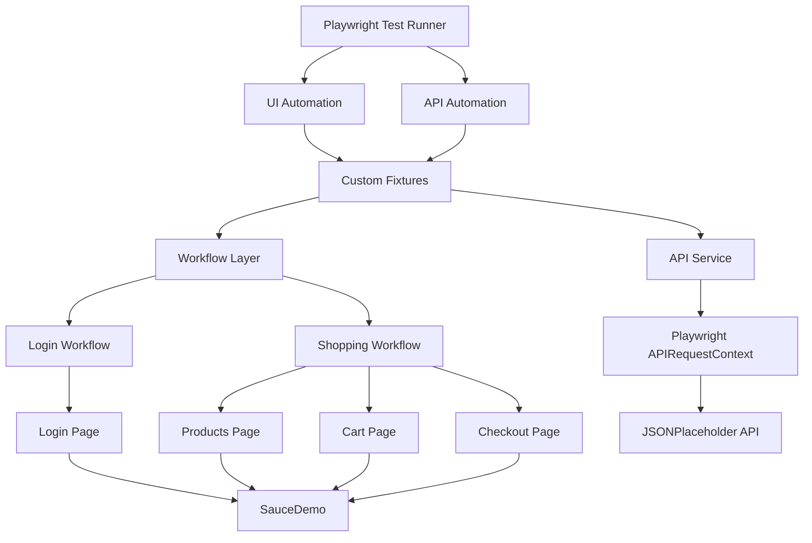

# Playwright TypeScript Layered Automation Framework

A UI and API automation framework built using Playwright and TypeScript, demonstrating layered test architecture, reusable components, custom fixtures, API automation, cross-browser testing, and GitHub Actions CI.

> **Portfolio Project:** This is an independent automation project built for demonstration purposes. SauceDemo is used as the application under test.

---

## 🚀 Project Overview

This project demonstrates how a Playwright automation framework can be structured for maintainability, reusability, and scalability.

The framework separates test scenarios from business workflows, page interactions, API services, test data, and shared test context.

It includes both UI and API automation and is configured to execute tests across Chromium, Firefox, and WebKit.

---

## 🛠️ Tech Stack

| Technology | Purpose |
|---|---|
| Playwright | UI and API automation |
| TypeScript | Programming language |
| Node.js | Runtime environment |
| Git | Version control |
| GitHub Actions | Continuous integration |
| JSONPlaceholder | API test environment |
| SauceDemo | UI test application |

---

## ✨ Key Features

- Playwright automation using TypeScript
- Layered automation architecture
- Page Object Model
- Workflow/business-layer abstraction
- Custom Playwright fixtures
- Reusable API service layer
- TypeScript interfaces for API models
- Test data management and user factory
- Positive and negative test scenarios
- End-to-end checkout workflow
- API GET and POST automation
- HTTP error response validation
- Cross-browser execution
- GitHub Actions CI
- Playwright HTML reporting
- Screenshots, videos, and traces configured for failure analysis

---

## 🧪 Test Coverage

### UI Automation

#### Authentication

- Login with valid standard user
- Login attempt with locked-out user

#### Checkout

- Login as standard user
- Add product to cart
- Open shopping cart
- Verify selected product
- Proceed to checkout
- Enter customer information
- Complete purchase
- Verify order confirmation

### API Automation

#### GET

- Retrieve an existing post
- Validate response data
- Validate response structure

#### POST

- Create a new post
- Validate created response
- Validate submitted request data

#### Negative Scenario

- Request a non-existent post
- Validate expected HTTP `404` response

---

## 🏗️ Architecture

The framework follows a layered architecture that separates test scenarios from UI implementation details and API communication.



### Layer Responsibilities

| Layer | Responsibility |
|---|---|
| Test Layer | Defines test scenarios and assertions |
| Fixture Layer | Creates and manages reusable test dependencies |
| Workflow Layer | Encapsulates business-level workflows |
| Page Object Layer | Encapsulates page locators and UI interactions |
| Service Layer | Encapsulates API communication |
| Model Layer | Defines TypeScript interfaces for structured data |
| Test Data Layer | Provides reusable test data and user factories |

---

## 📁 Project Structure

```text
playwright-typescript-layered-framework/
│
├── .github/
│   └── workflows/
│       └── playwright.yml
│
├── src/
│   ├── context/
│   │   └── test.context.ts
│   │
│   ├── fixtures/
│   │   └── test.fixture.ts
│   │
│   ├── models/
│   │   ├── post.model.ts
│   │   └── user.model.ts
│   │
│   ├── pages/
│   │   ├── cart.page.ts
│   │   ├── checkout.page.ts
│   │   ├── login.page.ts
│   │   └── products.page.ts
│   │
│   ├── services/
│   │   └── api.service.ts
│   │
│   ├── test-data/
│   │   ├── user.factory.ts
│   │   └── users.ts
│   │
│   └── workflows/
│       ├── login.workflow.ts
│       └── shopping.workflow.ts
│
├── tests/
│   ├── api/
│   │   └── posts.spec.ts
│   │
│   └── ui/
│       ├── checkout.spec.ts
│       └── login.spec.ts
│
├── .gitignore
├── package.json
├── package-lock.json
├── playwright.config.ts
├── tsconfig.json
└── README.md
```

---

## ⚙️ Getting Started

### Prerequisites

Install:

- Node.js 20 or later
- Git

### Clone the repository

```bash
git clone https://github.com/vinothks2442/playwright-typescript-layered-framework.git
cd playwright-typescript-layered-framework
```

### Install dependencies

```bash
npm ci
```

### Install Playwright browsers

```bash
npx playwright install
```

---

## ▶️ Running Tests

### Run the complete test suite

```bash
npx playwright test
```

### Run UI tests

```bash
npx playwright test tests/ui
```

### Run API tests

```bash
npx playwright test tests/api
```

### Run tests in a specific browser

```bash
npx playwright test --project=chromium
```

```bash
npx playwright test --project=firefox
```

```bash
npx playwright test --project=webkit
```

### Run a specific test file

```bash
npx playwright test tests/ui/checkout.spec.ts
```

### View the HTML report

```bash
npx playwright show-report
```

---

## 📊 Test Results

The current automated suite contains:

- **18 tests**
- **Chromium**
- **Firefox**
- **WebKit**
- UI automation
- API automation
- Positive and negative scenarios

The complete suite has been successfully executed locally and through GitHub Actions.

---

## 🔄 Continuous Integration

GitHub Actions automatically executes the Playwright test suite when changes are pushed to the `main` branch or when a pull request targets `main`.

CI pipeline:

```text
Git Push / Pull Request
          ↓
   Checkout Repository
          ↓
      Setup Node.js
          ↓
    Install Dependencies
          ↓
Install Playwright Browsers
          ↓
     Run Playwright Tests
          ↓
    Upload HTML Report
```

The CI workflow is defined in:

```text
.github/workflows/playwright.yml
```

---

## 🧠 Framework Design Decisions

### Why Page Objects?

Page Objects centralize selectors and UI interactions, reducing duplication and making UI changes easier to maintain.

### Why a Workflow Layer?

Business workflows are separated from low-level page interactions. This keeps test cases focused on business scenarios rather than implementation details.

### Why Custom Fixtures?

Custom fixtures provide reusable test dependencies and avoid repeatedly creating page objects and services inside individual tests.

### Why a Separate API Service?

API communication is centralized in a dedicated service layer, allowing API tests to focus on validation rather than request implementation details.

### Why TypeScript Models?

Interfaces provide compile-time structure for API request and response data, improving readability and reducing accidental misuse of data structures.

---

## 📌 Scope

This project focuses on demonstrating automation framework design rather than achieving exhaustive application coverage.

The framework can be extended with additional:

- UI workflows
- API endpoints
- Authentication strategies
- Test data sources
- Environment configurations
- Reporting integrations
- CI/CD capabilities

---

## 👤 Author

**Vinothkumar S**

QA Engineer (Manual + Automation)

GitHub:  
https://github.com/vinothks2442/playwright-typescript-layered-framework

---

## 📄 License

This project is intended for educational and portfolio demonstration purposes.